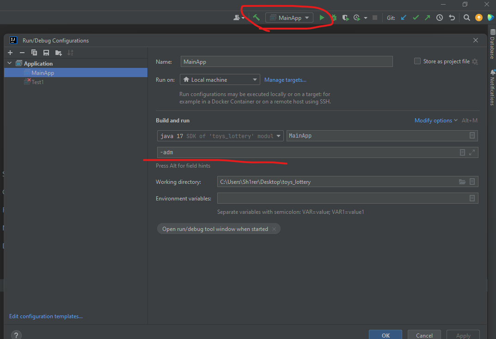

# Задание
Необходимо написать программу – розыгрыша игрушек в магазине детских товаров.
Стараемся применять ООП и работу с файлами.
Если какой-то пункт не изучали и не знаете, как сделать, то можете сделать своим способом. Например, у кого в курсе не было ООП, то применяем списки\массивы\словари

### Желательный функционал программы:
В программе должен быть минимум один класс со следующими свойствами:
- id игрушки,
- текстовое название,
- количество
- частота выпадения игрушки (вес в % от 100)
- Метод добавление новых игрушек и возможность изменения веса (частоты выпадения игрушки)
- Возможность организовать розыгрыш игрушек.

### Например, следующим образом:
С помощью метода выбора призовой игрушки – мы получаем эту призовую игрушку и записываем в список\массив.
Это список призовых игрушек, которые ожидают выдачи.
Еще у нас должен быть метод – получения призовой игрушки.
После его вызова – мы удаляем из списка\массива первую игрушку и сдвигаем массив. А эту игрушку записываем в текстовый файл.
Не забываем уменьшить количество игрушек

# Решение задания

## Параметры для запуска приложения:

### Java:

    java version "17.0.5" 2022-10-18 LTS
    Java(TM) SE Runtime Environment (build 17.0.5+9-LTS-191)

### Запуск:

    стабильно работает через Intellij IDEA

    нестабильно: через командную строку, так как не получилось разобраться с кодировками,
    отображения кириллицы, поэтому данные могут отображаться некорректно

## Режим администратора:
    
для запуска приложения в режиме администратора, нужно в конфигурации запуска приложения
указать аргумент командной строки: *__adm__*

введите пароль: 123456

### *Реализованы функции:*
    
    - Добавление игрушки в список
    - Просмотр списка всех игрушек
    - Добавление вопроса для викторины
    - Просмотр всех вопросов для викторины

## Режим участника розыгрыша:

для запуска приложения в режиме участника розыгрыша, нужно в конфигурации запуска приложения
указать аргумент командной строки: *__cns__*

### *Реализованы функции:*

    - запуск викторины с вопросами
    - Просмотр списка всех игрушек

